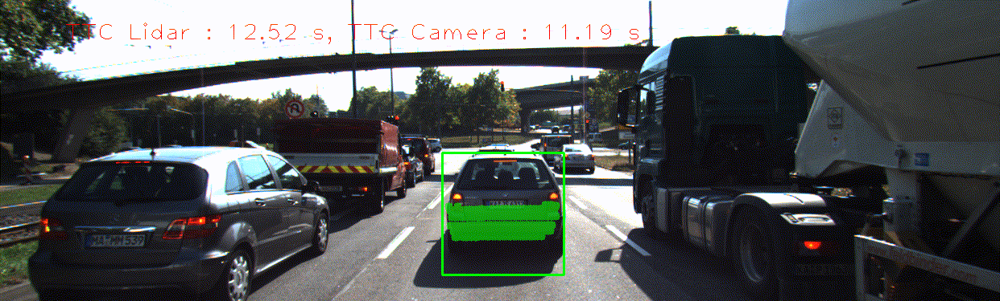
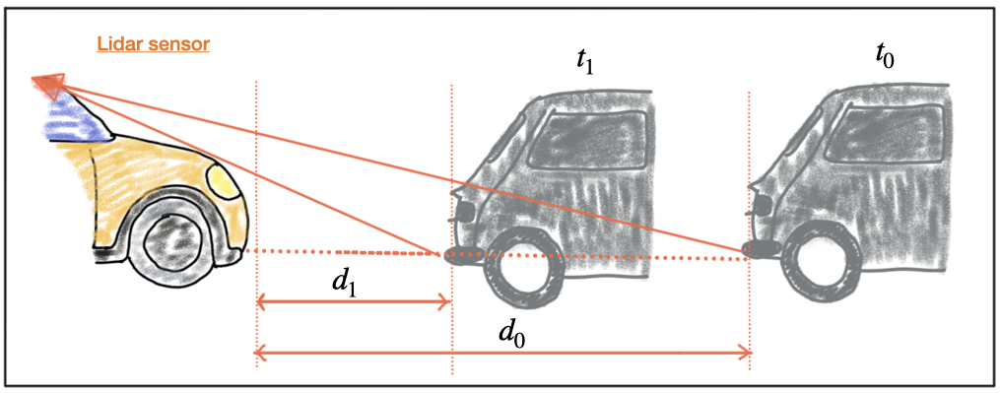
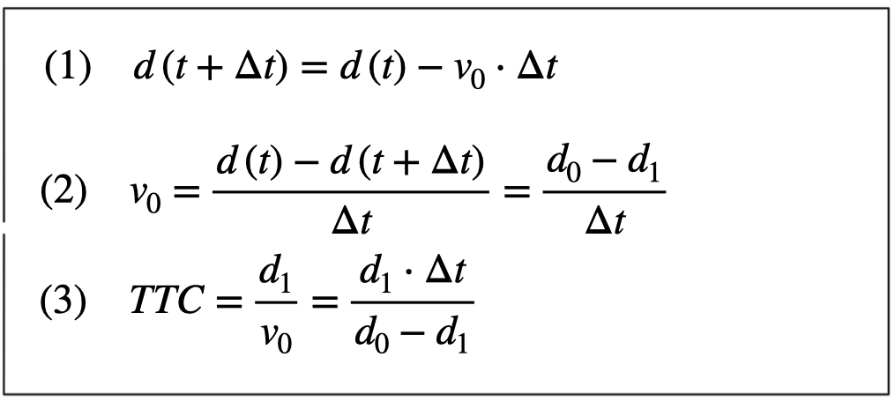
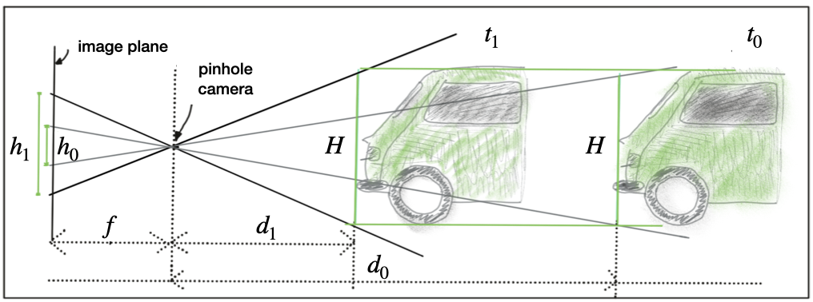
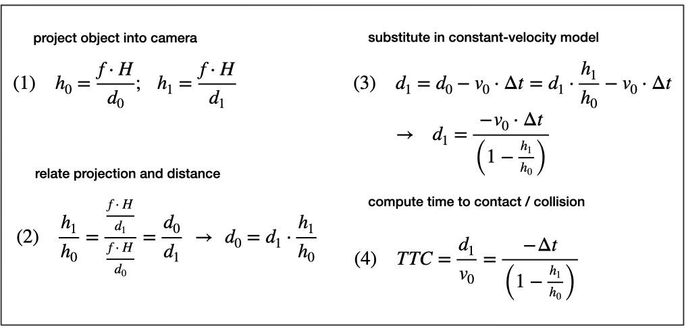

# 3D Object Tracking

_Image source: Udacity_

## Project Overview

This project implements a comprehensive 3D object tracking system for autonomous driving scenarios, focusing on robust time-to-collision (TTC) estimation using both Lidar and camera data. The system matches 3D objects across consecutive frames, associates keypoint correspondences with detected objects, and computes TTC estimates using multiple sensor modalities. Outlier rejection and statistical robustness are emphasized throughout the pipeline to ensure reliable collision detection and tracking performance. The project also includes a detailed performance evaluation of different detector-descriptor combinations and analyzes the accuracy of TTC estimates under various conditions.

## Objective

The primary objective is to build a reliable 3D object tracking and collision detection system that can:

- Match 3D objects (bounding boxes) between consecutive frames using keypoint correspondences
- Compute time-to-collision (TTC) estimates based on Lidar measurements, with robust outlier handling
- Associate camera keypoint matches with bounding boxes and filter outliers for accurate TTC calculation
- Compute camera-based TTC estimates using robust statistical methods
- Evaluate and compare the performance of different detector-descriptor combinations for TTC estimation
- Analyze and document cases where Lidar or camera-based TTC estimates are inaccurate, providing insights into potential causes and system limitations

## Methodology

The following methodology outlines the step-by-step approach used to implement robust 3D object tracking and time-to-collision estimation in this project. Each task builds upon the previous, integrating both Lidar and camera data to achieve accurate object association, correspondence filtering, and collision prediction. The methods described below emphasize statistical robustness and reliability, ensuring the system performs well in real-world autonomous driving scenarios.

### 1. Match 3D Objects

Implemented the [`matchBoundingBoxes`](src/camFusion_Student.cpp) method to associate bounding boxes between consecutive frames. For each keypoint match, the function determines which bounding boxes in the previous and current frames contain the matched keypoints and counts the number of correspondences between each pair. For every bounding box in the previous frame, the candidate in the current frame with the highest number of keypoint matches is selected, ensuring robust and accurate object association across frames.

### 2. Compute Lidar-based TTC

_Image source: Udacity_

Implemented the [`computeTTCLidar`](src/camFusion_Student.cpp) function to estimate time-to-collision (TTC) for matched 3D objects using only Lidar measurements. The method extracts forward distance values from Lidar points within each bounding box for both previous and current frames, then uses the median of these distances to reduce the influence of outliers. TTC is calculated based on the change in median distance and frame rate, providing reliable collision prediction while minimizing the impact of erroneous Lidar measurements.

### 3. Associate Keypoint Correspondences with Bounding Boxes

Implemented the [`clusterKptMatchesWithROI`](src/camFusion_Student.cpp) function to associate keypoint correspondences with their respective bounding boxes. For each bounding box, all matches where the current keypoint lies within the region of interest are collected and stored in the `kptMatches` property. The Euclidean distances between matched keypoints are analyzed, and outliers are removed using statistical filtering, resulting in a robust set of correspondences for each object to support accurate TTC calculations.

### 4. Compute Camera-based TTC

_Image source: Udacity_

Implemented the [`computeTTCCamera`](src/camFusion_Student.cpp) function to estimate time-to-collision (TTC) for matched 3D objects using keypoint correspondences. The method calculates the change in scale between matched keypoints across consecutive frames and uses the median of distance ratios to filter out outliers. This approach ensures robust and reliable TTC estimation for each tracked object, minimizing the impact of erroneous matches.
