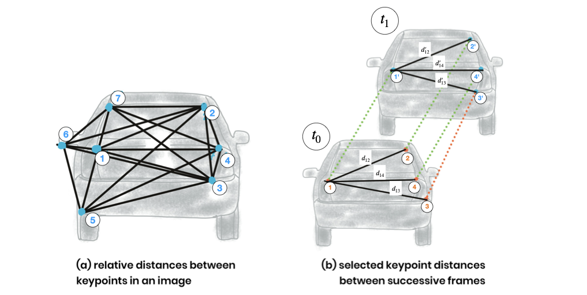
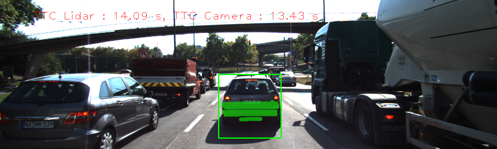
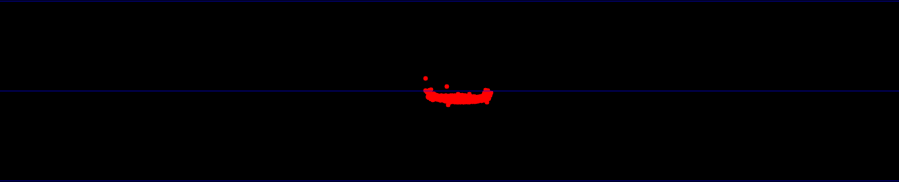
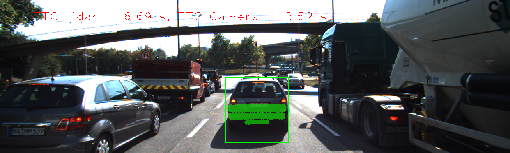
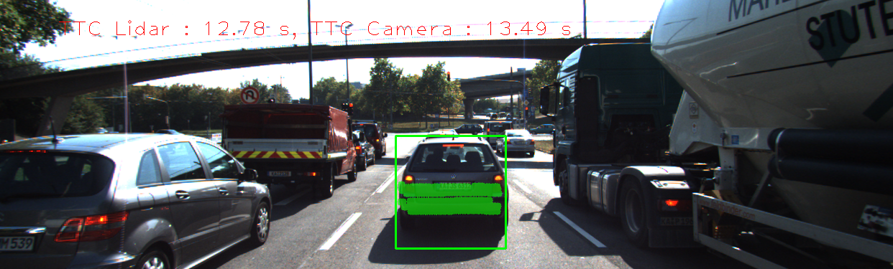
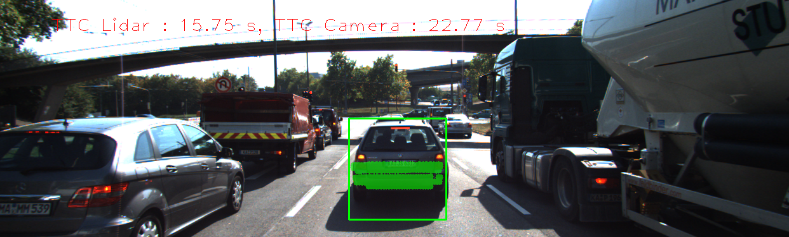

# 3D Object Tracking

## Project Overview

This project implements a comprehensive 3D object tracking system for autonomous driving scenarios, focusing on robust time-to-collision (TTC) estimation using both Lidar and camera data. It employs YOLO for object detection, matches 3D objects across consecutive frames, associates keypoint correspondences with detected objects, and computes TTC estimates using multiple sensor modalities. Outlier rejection and statistical robustness are emphasized throughout the pipeline to ensure reliable collision detection and tracking performance. The project also includes a detailed performance evaluation of different detector-descriptor combinations and analyzes the accuracy of TTC estimates under various conditions.

## Objective

The primary objective is to build a reliable 3D object tracking and collision detection system that can:

- Detect objects using YOLO
- Match 3D objects (bounding boxes) between consecutive frames using keypoint correspondences
- Compute time-to-collision (TTC) estimates based on Lidar measurements, with robust outlier handling
- Associate camera keypoint matches with bounding boxes and filter outliers for accurate TTC calculation
- Compute camera-based TTC estimates using robust statistical methods
- Evaluate and compare the performance of different detector-descriptor combinations for TTC estimation
- Analyze and document cases where Lidar or camera-based TTC estimates are inaccurate, providing insights into potential causes and system limitations

## Methodology

The following methodology outlines the step-by-step approach used to implement robust 3D object tracking and time-to-collision estimation in this project. Each task builds upon the previous, integrating both Lidar and camera data to achieve accurate object association, correspondence filtering, and collision prediction. The methods described below emphasize statistical robustness and reliability, ensuring the system performs well in real-world autonomous driving scenarios.

### 1. Match 3D Objects

Implemented the [`matchBoundingBoxes`](src/camFusion_Student.cpp) method to associate bounding boxes between consecutive frames. For each keypoint match, the function determines which bounding boxes in the previous and current frames contain the matched keypoints and counts the number of correspondences between each pair. For every bounding box in the previous frame, the candidate in the current frame with the highest number of keypoint matches is selected, ensuring robust and accurate object association across frames.

### 2. Compute Lidar-based TTC

_Image source: Udacity_

Implemented the [`computeTTCLidar`](src/camFusion_Student.cpp) function to estimate time-to-collision (TTC) for matched 3D objects using only Lidar measurements. The method extracts forward distance values from Lidar points within each bounding box for both previous and current frames, then uses the median of these distances to reduce the influence of outliers. TTC is calculated based on the change in median distance and frame rate, providing reliable collision prediction while minimizing the impact of erroneous Lidar measurements.

### 3. Associate Keypoint Correspondences with Bounding Boxes

_Image source: Udacity_

Implemented the [`clusterKptMatchesWithROI`](src/camFusion_Student.cpp) function to associate keypoint correspondences with their respective bounding boxes. For each bounding box, all matches where the current keypoint lies within the region of interest are collected and stored in the `kptMatches` property. The Euclidean distances between matched keypoints are analyzed, and outliers are removed using statistical filtering, resulting in a robust set of correspondences for each object to support accurate TTC calculations.

### 4. Compute Camera-based TTC

_Image source: Udacity_

Implemented the [`computeTTCCamera`](src/camFusion_Student.cpp) function to estimate time-to-collision (TTC) for matched 3D objects using keypoint correspondences. The method calculates the change in scale between matched keypoints across consecutive frames and uses the median of distance ratios to filter out outliers. This approach ensures robust and reliable TTC estimation for each tracked object, minimizing the impact of erroneous matches.

### 5. Performance Evaluation of Lidar-based TTC

Below are several examples where the Lidar-based TTC estimate appears way off, based on manual inspection of the top view Lidar screenshots and the corresponding TTC printouts.

As seen in the screenshots below, the top view shows some outliers in certain frames and these outliers were responsible for errors in our TTC. For example, the TTC in frame 3 jumped from 14.09s to 16.69s in frame 4 and then back to 12.78s in frame 6, with all these happening within a short time. These sudden fluctuations are not physically possible and show how sensitive the Lidar-based TTC calculation can be to outlier points. This shows that theses outliers need to be filtered out to be able to accurately estimate Lidar-based TTC.

#### LidarTTC: Frame 3

#### LidarTTC: Frame 4

#### LidarTTC: Frame 6

### 6. Performance Evaluation of Camera-based TTC

The table below shows the detector/descriptor combinations for Camera-based TTC when compared with Lidar-based TTC in ascending order. In the table below, frame with lowest difference between Lidar-based TTC and Camera-based TTC was picked.

Certain detectors such as Harris produced very unreliable camera TTC value that are way off when compared to other detectors as shown below. FAST, AKAZE, ORB and SIFT detector produce accurate Camera TTC value that are not far off from Lidar TTC value. However, just like in Lidar-based TTC, there are some frames where even the Camera TTC value are far off as seen in screenshot below. In the screenshot below, FAST detector + BRIEF descriptor (best detector/descriptor selected in 2D feature detection project) was used and TTC in frame 4 jumped from 13.52s to 22.77s in frame 5 and then back to 13.49s in frame 6, with all these happening within a short time.

#### Detector/Descriptor TTC Evaluation Table

| Frame index | Detector  | Descriptor | Lidar-based TTC | Camera-based TTC | TTC difference |
| ----------- | --------- | ---------- | --------------- | ---------------- | -------------- |
| 15          | ORB       | FREAK      | 8.52            | 8.53             | 0.01           |
| 17          | AKAZE     | BRISK      | 9.61            | 9.6              | 0.01           |
| 16          | ORB       | BRIEF      | 9.52            | 9.5              | 0.02           |
| 3           | BRISK     | BRISK      | 14.09           | 14.07            | 0.02           |
| 17          | AKAZE     | BRIEF      | 9.61            | 9.58             | 0.03           |
| 11          | BRISK     | BRIEF      | 12.81           | 12.76            | 0.05           |
| 7           | SHITOMASI | ORB        | 11.98           | 11.93            | 0.05           |
| 1           | BRISK     | FREAK      | 12.52           | 12.46            | 0.06           |
| 9           | SIFT      | BRISK      | 13.02           | 13.08            | 0.06           |
| 9           | FAST      | SIFT       | 13.02           | 13.08            | 0.06           |
| 7           | FAST      | BRISK      | 11.98           | 11.9             | 0.08           |
| 9           | FAST      | BRIEF      | 13.02           | 13.1             | 0.08           |
| 5           | SIFT      | FREAK      | 15.75           | 15.82            | 0.07           |
| 10          | BRISK     | ORB        | 11.17           | 11.26            | 0.09           |
| 14          | AKAZE     | FREAK      | 9.6             | 9.7              | 0.1            |
| 14          | ORB       | BRISK      | 9.6             | 9.47             | 0.13           |
| 2           | SIFT      | SIFT       | 12.61           | 12.75            | 0.14           |
| 1           | AKAZE     | SIFT       | 12.52           | 12.38            | 0.14           |
| 1           | AKAZE     | ORB        | 12.52           | 12.36            | 0.16           |
| 7           | FAST      | ORB        | 11.98           | 12.15            | 0.17           |
| 1           | AKAZE     | AKAZE      | 12.52           | 12.28            | 0.24           |
| 6           | FAST      | FREAK      | 12.78           | 12.52            | 0.26           |
| 2           | SHITOMASI | BRISK      | 12.61           | 12.9             | 0.29           |
| 14          | SIFT      | BRIEF      | 9.6             | 9.93             | 0.33           |
| 2           | ORB       | SIFT       | 12.61           | 12.97            | 0.36           |
| 18          | SHITOMASI | FREAK      | 8.4             | 8.77             | 0.37           |
| 6           | SHITOMASI | SIFT       | 12.78           | 13.15            | 0.37           |
| 1           | BRISK     | SIFT       | 12.52           | 12.93            | 0.41           |
| 13          | ORB       | ORB        | 9.96            | 10.42            | 0.46           |
| 8           | HARRIS    | BRIEF      | 13.12           | 13.57            | 0.45           |
| 8           | HARRIS    | ORB        | 13.12           | 13.57            | 0.45           |
| 8           | HARRIS    | SIFT       | 13.12           | 13.57            | 0.45           |
| 18          | SHITOMASI | BRIEF      | 8.4             | 7.75             | 0.65           |
| 6           | HARRIS    | BRISK      | 12.78           | 13.56            | 0.78           |
| 11          | HARRIS    | FREAK      | 12.81           | 11.74            | 1.07           |

#### CameraTTC: Frame 4

#### CameraTTC: Frame 5

#### CameraTTC: Frame 6

